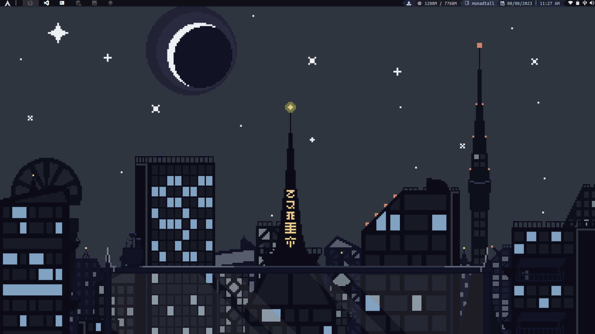
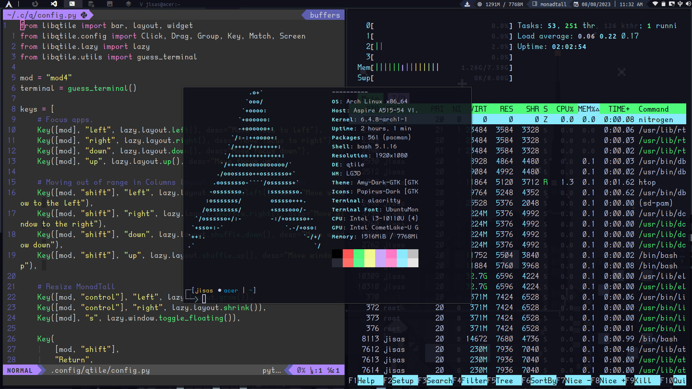
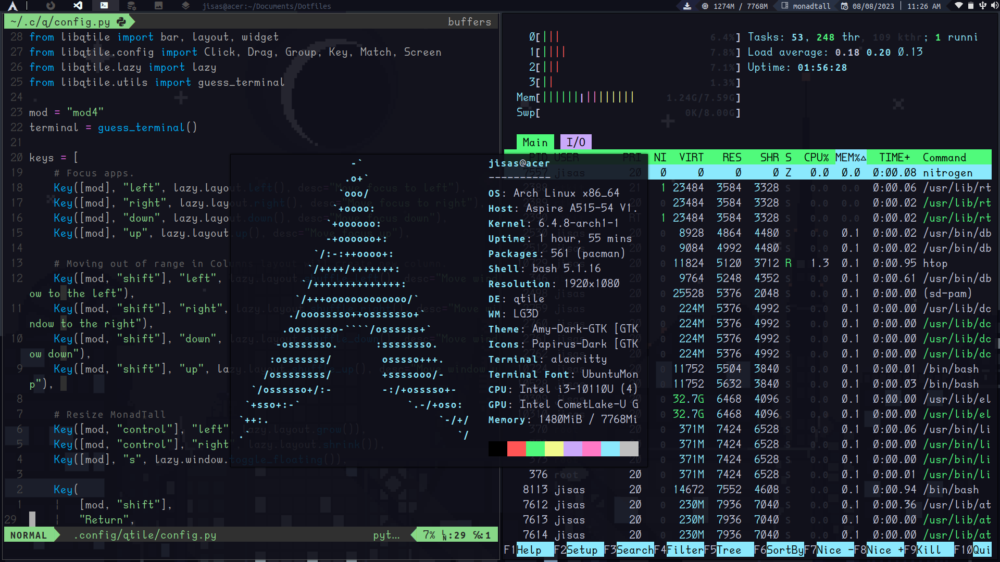

# Dotfiles Qtile

<!---->
<!---->
<div style="">


</div>

# Instalation 
Clon repo
```bash
git clone https://github.com/JsusMachaca/Dotfiles.git
```
Requirements of WM
```bash
sudo pacman -S qtile alacritty nitrogen picom rofi ranger git
```
## Icons and applications


|        **Name**         |        **Type**        | 
|-------------------------|:----------------------:|
| lsd                     |              ls command|
| bat                     |              cat comman| 
| neovim                  |             Text Editor| 
| volumeicon              |             Volume Icon| 
| cbatticon               |            Battery Icon| 
| nm-applet               |             Wifi Gestor|
| flameshot               |          Screen Capture| 
| udiskie, udiskie2       |   Disc Icon, Mount Disc|
| ntfs-3g                 |Support NTFS File System|
| bash-completion         |       Autocomplete Bash|
| python-psutil           |        Qtile Dependence| 
| htop                    |      Process Controller|
| brightnessctl           |   Brightness Controller|
| pulseaudio              |        Audio Controller|
| lxappearance            |         Themes Selector|
| brave-bin               |           Web Navegator|
| visual-studio-code-bin  |             Text Editor|
| intellij-idea-community |                Java IDE|
| zip                     |              Compressor|


# Themes and Icons

|        **FONTS**        |     **ICON THEME**     |      **THEME**      |
|:-----------------------:|:----------------------:|:-------------------:|
|   UbuntuMono Nerd Font  |    Amy Light Icons     |     Amy-Dark-GTK    |
|    Hack Nerd Font       | Dexy Color Light Icons | Dexy-Color-Dark-GTK |
| JetBrainsMono Nerd Font | Papirus (Papirus-Dark) |          *          |
| DaddyTimeMono Nerd Font |    Material Black      |          *          |
| CaskaydiaCove Nerd Font |            *           |          *          |

